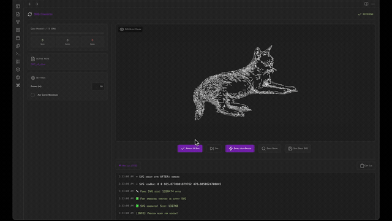
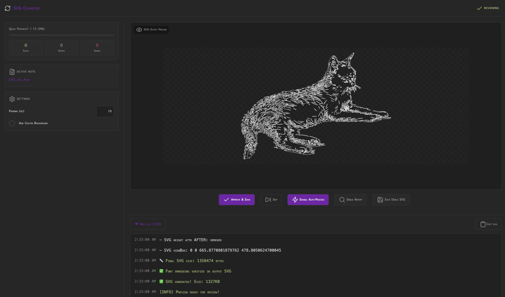

  
  
  <h1 align="center">SVGConverter</h1>
  <h3 align="center"> Automated Excalidraw Markdown to Portable SVG Converter </h3>

  <!-- TOP PURPLE LINKS -->
  
  
  
   
  <!-- BOTTOM GOLD TAXONOMY -->
  
  
  
  

  

    <i> An advanced automated pipeline that converts Excalidraw markdown files into optimized, self-contained SVGs with embedded fonts and resolved dependencies. </i>
  

  

Welcome to **SVG Converter**, an advanced batch conversion pipeline designed to convert Excalidraw drawings (`.md`) inside Obsidian into optimized, self-contained, and portable `.svg` files. It features font-embedding, nested dependency resolution, live rendering previews, auto-process mode, and an expandable debug console.

---

## Quick Start

To start trying SVG Converter today:
1. **Download the Repository**: Clone or download this repository directly into any folder inside your Obsidian vault.
2. **Install Datacore**: Ensure you have the **Datacore** plugin installed and enabled in Obsidian.
3. **Open the Entry Note**: Open the **`SVG CONVERTER.md`** note inside Obsidian to launch the component!

---

## Features

### Batch Conversion Pipeline
*   **File Discovery**: Finds all `.md` Excalidraw files in a specified folder that do not yet have corresponding `.svg` files.
*   **Dependency Resolution**: Analyzes drawings for embedded Excalidraw sub-drawings, building a topological sort order to convert nested assets first.
*   **Data Extraction**: Extracts and decompresses JSON data from Obsidian Excalidraw notes and converts it via UMD Excalidraw export libraries.

### Self-Contained Export Engine
*   **Base64 Font Embedding**: Detects used font styles (Virgil, Cascadia, etc.) and embeds the actual font files as Base64 data directly into the SVG’s `<style>` tag, ensuring text renders consistently offline or on devices without the font.
*   **SVG Sub-Asset Embedding**: Embedded SVG sub-drawings are resolved and compiled into a single unified composite vector image.

### Host-Native Theme Adaptability
*   **Adaptive UI**: Built with host-native theme controls (`var(--background-primary)`, `var(--interactive-accent)`) ensuring layout blends perfectly with Obsidian's dark/light modes.
*   **Full-Tab Scrollbar Suppression**: Employs double-layer CSS overrides and DOM hijacking to provide a seamless edge-to-edge layout inside Obsidian workspaces.

---

## Directory Index & Components

The package exposes the following compiled files:

| File | Description |
| :--- | :--- |
| **[SVG CONVERTER.md](SVG%20CONVERTER.md)** | The main entry point note designed to be opened in Obsidian. |
| **[src/index.jsx](src/index.jsx)** | Bootstrapper component with dynamic status-bar and scrollbar suppression. |
| **[src/App.jsx](src/App.jsx)** | Main component shell containing UI states, batch processing loop, and font-embedding tools. |
| **[METADATA.md](METADATA.md)** | Manifest mapping indexing properties and target runtime. |
| **[CONTRIBUTION.md](CONTRIBUTION.md)** | Local execution guidelines. |
| **[LICENSE.md](LICENSE.md)** | MIT license configuration. |
| **[assets/image/preview_1.webp](assets/image/preview_1.webp)** | High-fidelity static preview image of the component. |
| **[assets/videos/preview.gif](assets/videos/preview.gif)** | Walkthrough loop walkthrough GIF. |

---

## Previews

| Card Layout | Batch Converter Explorer |
| :---: | :---: |
|  |  |

---

## Contributors
- beto.group
